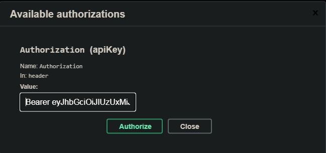

# Spring Blog

Full Stack Blog to create your own blog

## Getting Started

To test this project you can either use Docker to install everything or install Angular, Java and MySql on your machine to run this project.

### Prerequisites

* Docker
* Mysql
* Java 11
* Angular CLI: 12.0.5.

### Installing

* Clone this project repository
* Install Mysql
* Install Java 11 (This project I used AdoptOpenJdk)
* Install Angular CLI: 12.0.5
  * Run npm install -g @angular/cli to install Globally or npm install @angular/cli to install locally. To install Install Specific Version (Example: 12.0.5) npm install -g @angular/cli@12.0.5.

Run Spring Blog Server

* ```cd spring-boot-server && mvnw spring-boot:run```

Run Spring Blog Client with proxy to api Spring Blog Backend

* ```cd spring-boot-client && npm start```

```
Open the url http://localhost:4200
```

```Admin Login
user:brian123
password:brian123
```

## Running the tests

Open a url above to see the Swagger documentation

* http://localhost:8080/swagger-ui/index.html
* Run endpoint to generate token ```auth-controller -> /api/auth/signin```
* Copy the token from ```accessToken``` without quotation marks
* In Authorize put name ```Bearer``` with space and your token copied.
* Now you can save, delete and update everything



## Deployment

Instructions how to install **Docker** on [Ubuntu](https://docs.docker.com/install/linux/docker-ce/ubuntu/), [Windows](https://docs.docker.com/docker-for-windows/install/), [Mac](https://docs.docker.com/docker-for-mac/install/).

How to run it?

Run this command in a terminal:

* ```docker-compose up --build``` - Build and start the containers.
* ```docker-machine ip default``` - Get docker host ip address.
* To access use ```http://localhost:4200/``` or ```http://<docker host ip address>:4200/```

## Built With

### spring-blog-frontend

* [Angular CLI: 12.0.5](https://www.npmjs.com/package/@angular/cli/v/12.0.5)
* [Bulma 0.9.3](https://www.npmjs.com/package/bulma)
* [Ngx-toastr](https://www.npmjs.com/package/ngx-toastr/v/14.0.0)
* [ng-select](https://www.npmjs.com/package/@ng-select/ng-select/v/7.2.0)
* [kolkov/angular-editor 1.2.0](https://www.npmjs.com/package/@kolkov/angular-editor/v/1.2.0)
* [Fontawesome-free 5.15.4](https://www.npmjs.com/package/@fortawesome/fontawesome-free/v/5.15.4)
* [@angular/animations](https://www.npmjs.com/package/@angular/animations/v/12.2.2)

### spring-blog-backend

* Java 11
* Mysql
* Spring Data Rest
* jjwt:0.9.1
* lombok
* spring-boot-starter-parent: 2.5.2
* spring-boot-starter-security
* spring-boot-starter-web
* spring-boot-starter-validation
* spring-boot-devtools
* jackson-datatype-jsr310
* spring-boot-starter-data-jpa
* h2-database

## Features

* Authentication using JWT in Spring Boot.
* Admin can save,update or delete Tags and Categories
* User can create Posts, select Tags and Categories
* Edit your name, email and password
* Delete your account

* To do delombok use this command in folder kanban-spring-backend `mvnw lombok:delombok -Pdlombok`
  * The output will be `\target\generated-sources\delombok\`

## Contributing

1. Clone this repository
1. Make a new branch
1. Commit and push your changes
1. Create a Pull Request

## Authors

* **Braian Silva** - [Github](https://github.com/BraianS) [Twitter](https://twitter.com/braiancode) - [Gmail](mailto:braiannogueirasilva@gmail.com)

## License

This project is licensed under the MIT License - see the [LICENSE.md](LICENSE.md) file for details

Copyright (c) 2021 **Braian Silva**

## Acknowledgments

* Inspiration about Spring Security with JWT Token - [Callicoder - Spring Boot + Spring Security + JWT + MySQL + React Full Stack Polling App](https://www.callicoder.com/spring-boot-spring-security-jwt-mysql-react-app-part-1/)
